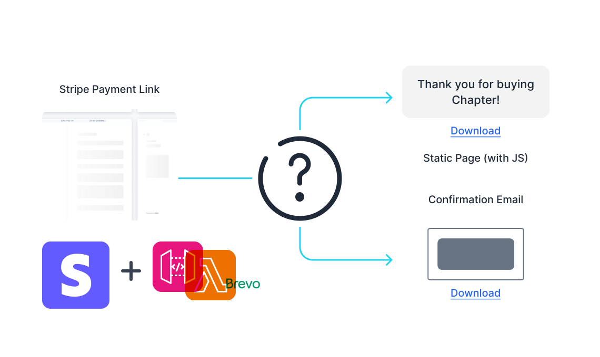
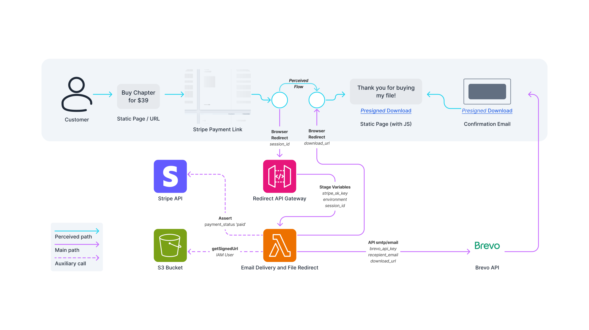

This is a simple serverless application that uses AWS Lambda, Stripe and Brevo to deliver files to customers after they have made a payment via your Stripe Payment Link. Because Gumroad and KoFi may be nice, but why not manage your own payment links and have a straight-forward user experience?

## Demo

[Expand to see the demo of the finished solution](https://github.com/MNeverOff/stripe-link-file-delivery/assets/3989091/4ae214e3-33a3-461c-89b5-65b08a02b562)

## In-depth guide

You can read a detailed guide on setting this up in [my blog](https://neveroff.dev/blog/stripe-payment-link-file-download-with-email/).

## Getting started without the guide

1. Check out the repository into a local folder, open the terminal at the root folder.
2. Do `cd file-and-email-delivery && npm install && npm run build && cd dist && zip -r ../../file-and-email-delivery.zip .`. This set of commands will install npm modules, build the code and tree-shake it via webpack, generate a dist folder with a single .js file and .zip it for upload to AWS.
3. Create a new IAM role with the S3 `GetObject` permission for your object and bucket, generate an Access Key pair.
4. Create a new Lambda function, call it `file-and-email-delivery`, upload the .zip file you've just 1reated. Set Lambda Configuration to 1,769 MB Memory or whatever's the latest value that gives you a full 1vCPU accoridng to [the manual](https://docs.aws.amazon.com/lambda/latest/dg/configuration-function-common.html#configuration-memory-console).
5. Configure the API Gateway to point to the Lambda functions and supply the Stage Varibles as per the `index.js` files in both 1ile and email delivery folders, see Variables below. It's worth it to create two Stages - `prod` and `test` to be able to use 1tripe Test mode separately.
6. Configure the Environment Variables as per the `index.js` or the Variables reference below.
7. Configure the Stripe Payment Link to point to the API Gateway URL for the `file-and-email-delivery` Lambda.
8. Configure Brevo and your Static Site, get the Brevo Tempalte ID, API Key, insert the script to initiate the download from [download_url.html](/download_url.html), insert the Stripe Payment Link URL or Button embed.
9. Use the Stripe Test mode to ensure that your customer path is working as expected and an email is sent out with the file download link.

## Variables

### Environment Variables

Provide thtese under Lambda -> Configuration -> Environment Variables:

| Label | Note |
| -------- | --- |
| S3_ACCESS_KEY_ID | The IAM user Access Key |
| S3_SECRET_ACCESS_KEY | The IAM user Access Secret Key |
| S3_REGION | The region of your S3 bucket. `us-east-1` by default |
| bucket_name | The name of S3 bucket with the file, `file-delivery` in our case |
| object_key | The file's object key, `file.zip` |
| redirect_host | The url of our confirmation page |
| brevo_api_key | The API Key from Brevo which we'll set up later, leave it as `TBD` |
| brevo_template_id | The ID of the template in Brevo, by default it's `1` |
| link_expiration | The number of seconds the file will be acessible via the link. Cannot exceed 7 days, which is `604800` seconds |
| fallback_email | An email to send message to in case customer haven't provided their email during checkout |
| support_email | A parameter to show customers if payment confirmation failed to contact |
| email_mode | Whether the code should await email server response and log it. Unless the value is `ensure-delivery` it will be sent but the answer won't be awaited and logged |
| utm_parameters | Optional UTM parameters to add after the redirect url. Enter `&none` by default |

### Stage Variables

Provide thtese under API Gateway -> Stage -> Stage Variables:

| Label | Note |
| -------- | --- |
| environment | Text to identify the environment in logs |
| stripe_secret_api_key | The Secret Key from Stripe Developer dashboard |

## Full Flow Diagram

This diagram roughly outlines the flow of the application. The customer clicks the Stripe Payment Link, is redirected to the API Gateway, which triggers the Lambda function. The Lambda function checks the payment status with Stripe, if it's successful, it sends an email with the download link and redirects the customer to the confirmation page. If the payment is not successful, it redirects the customer to the support email.

## Separate Lambdas

If you navigate to [separate-lambdas](/separate-lambdas) you can find a version of the application that uses separate Lambdas for each of the functions. This is useful if you want to have a more granular control over the permissions and the codebase or want to rely on webhooks more heavily, or want each of the lambdas to execute just a bit quicker - it's all up to you.
Bear in mind that I am not updating thoe files in lockstep so some of the variables might be different, specifically - they are woefully unoptimised compared to the current combined version with execution times in 1,000-1,500ms and still don't rely on built-in aws-sdk-js-v3 that Lambda environment provides.

## Performance

When configured with 1 vCPU (currently 1,769 MB) the cold start is ~450ms and execution is ~300ms, **achieving sub-750ms processing**.

If the function is hot then the total execution goes down to ~200ms.

These figures assume `email_mode` is not set to `ensure-delivery`. If it is then both cold and hot execution times rises by about 100-150ms.

### Potential improvements

1. It's possible to use a language different from JS (Go?) that would have faster execution times or better init times. JS is not the fastest, but with tree-shaking it gets sub 750ms which is commendable.
2. It's further possible to add better handling to email failure, potentially by sending an email to the `support_email` with a report on the failure.

## Contributing

I'm open to contribution and suggestions, feel free to open an issue or a pull request.

I would be especially grateful for suggestions on how to speed up the Lambda to sub-1000ms execution time. Currently the Init is about 1000ms and Execution hovers around 2500ms, producing a noticeable delay for the customer.

## License

This project is licensed under the MIT License - see the [LICENSE](LICENSE) file for details.
